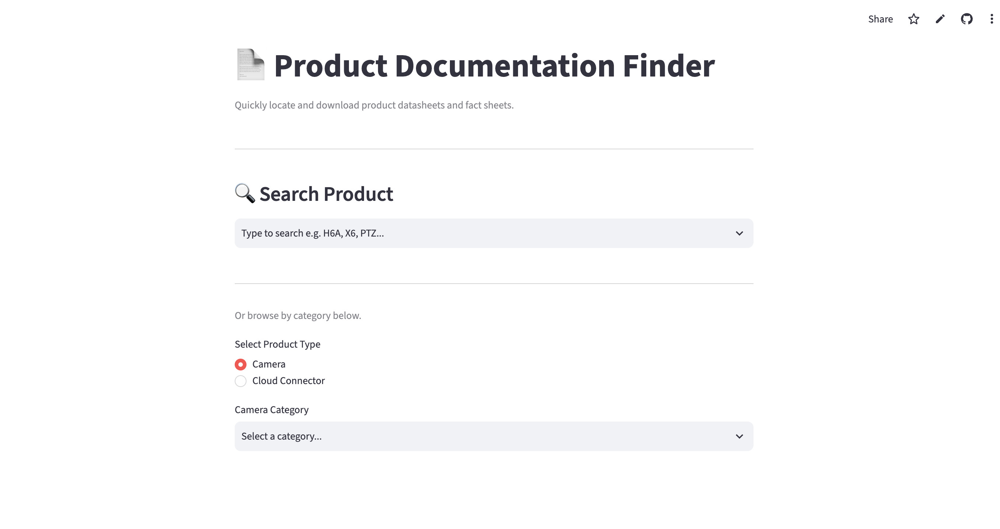

# 📄 Product Documentation Finder

A web application built with **Python** and **Streamlit** that automates searching and downloading product documentation directly from the official **Avigilon** website.

The application enables users to quickly locate **datasheets**, **fact sheets**, and **documentation portal links** for both **current** and **discontinued** Avigilon products, eliminating repetitive manual searches and significantly reducing documentation lookup time.

---

# 🚀 Live Demo

🌐 **https://spec-sheet-finder.streamlit.app/**

No installation required—simply open the link and start searching.

---

# 📸 Application Preview



---

# 💼 Business Problem

Technical Support team frequently need to retrieve product documentation while assisting customers.

Traditionally, this process requires:

- Navigating multiple webpages
- Browsing through product categories
- Opening individual product pages
- Searching for datasheets and fact sheets manually

This repetitive workflow is time-consuming and reduces support efficiency.

---

# 💡 Solution

Product Documentation Finder automates the documentation retrieval process through an intuitive web interface.

Users can:

- 🔍 Search products by model name
- 📂 Browse products by category
- 📄 View available datasheets and fact sheets
- ⬇ Download documentation with a single click
- 🔗 Access documentation hosted on the Avigilon Documentation Portal

The application retrieves information directly from the official Avigilon website, ensuring users always access the latest available documentation.

---

# ✨ Features

- 🔍 Search products by model name
- 📂 Browse products by category
- 📷 Supports Avigilon Cameras
- ☁ Supports Avigilon Cloud Connectors
- 📄 View available Datasheets and Fact Sheets
- ⬇ Download PDF documentation directly from the browser
- 🔗 Open documentation from the Avigilon Documentation Portal
- 📁 Includes both current and discontinued products
- ⚡ Fast performance using Streamlit caching
- 🌐 Responsive web application accessible from any device

---

# ⚙️ Installation

Clone the repository

```bash
git clone https://github.com/vtspnkj/product-documentation-finder.git
```

Navigate to the project

```bash
cd product-documentation-finder
```

Install the required packages

```bash
pip install -r requirements.txt
```

Run the application

```bash
streamlit run app.py
```

---

# 📈 Project Highlights

- Built a complete web application using Python and Streamlit
- Automated repetitive documentation retrieval workflows
- Dynamically retrieves product information from the official Avigilon website
- Supports both current and discontinued products
- Implements product search and category-based navigation
- Downloads documentation directly through the browser
- Uses Streamlit caching to improve application performance
- Reduces manual effort required to locate technical documentation

---


**GitHub**  
https://github.com/vtspnkj

**LinkedIn**  
https://www.linkedin.com/in/pankaj-vats-84701b114/

**Tableau Public**  
https://public.tableau.com/app/profile/pankaj.vats8347

---

⭐ If you found this project helpful, consider giving it a star!